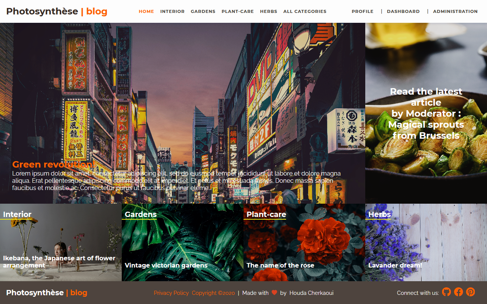
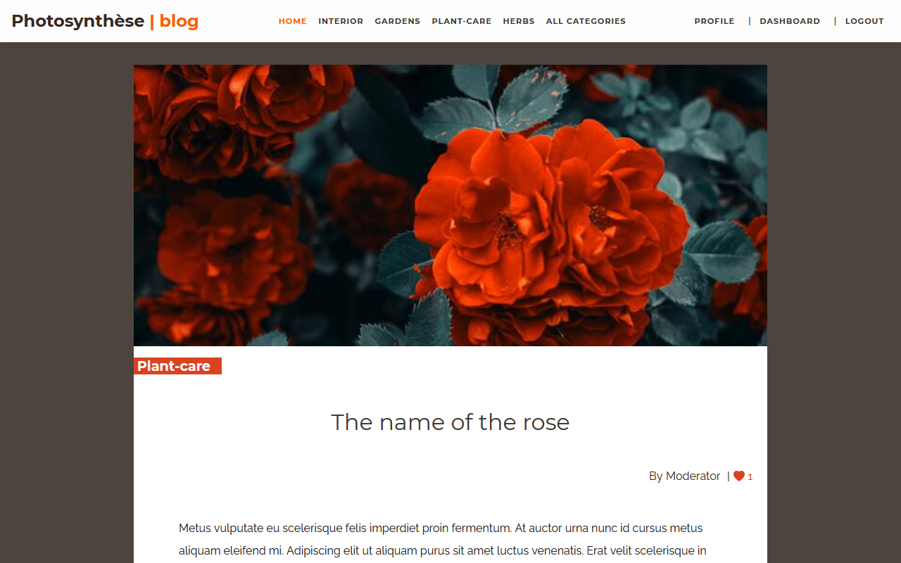
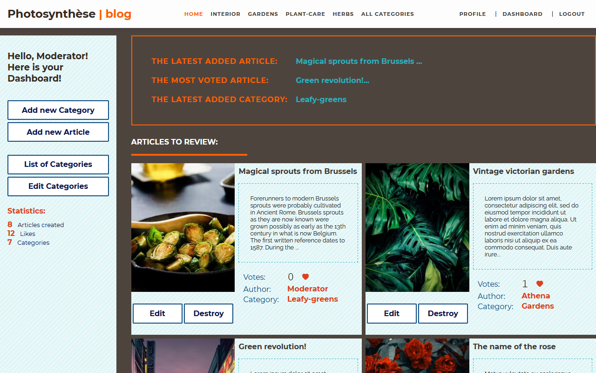
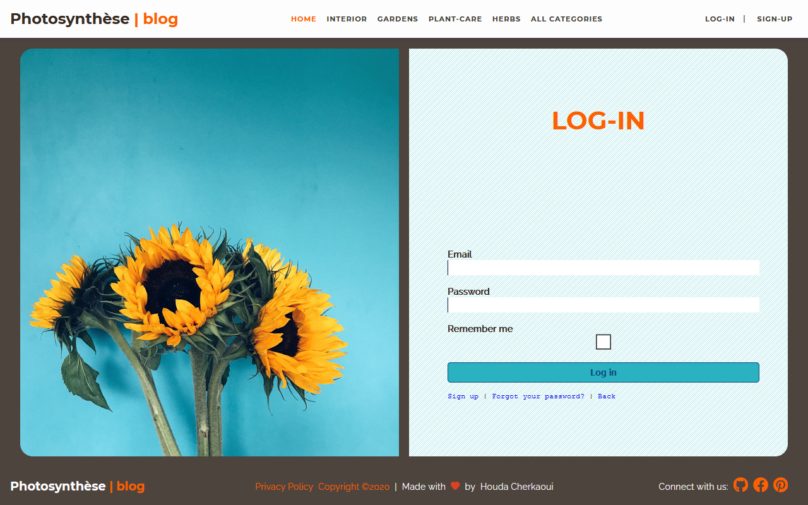
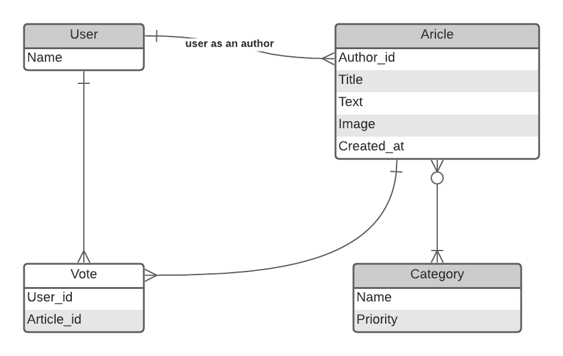
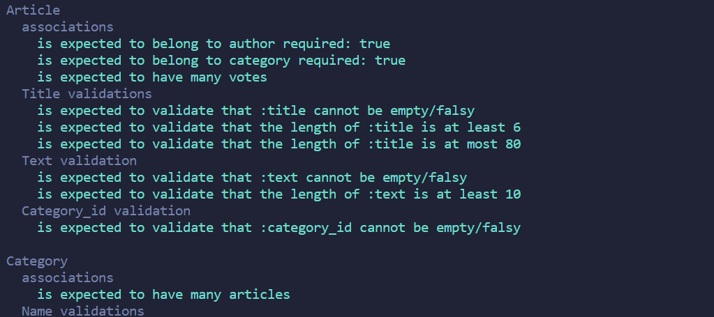
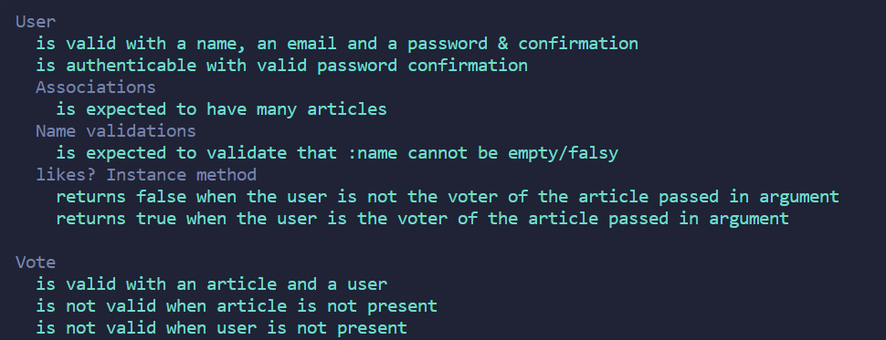
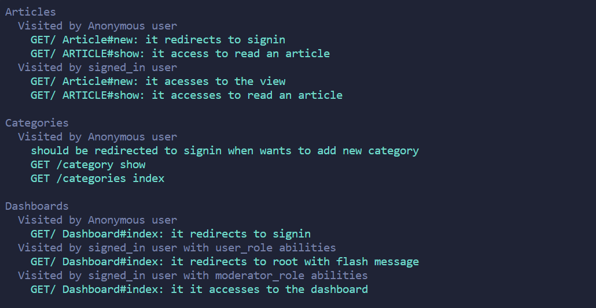
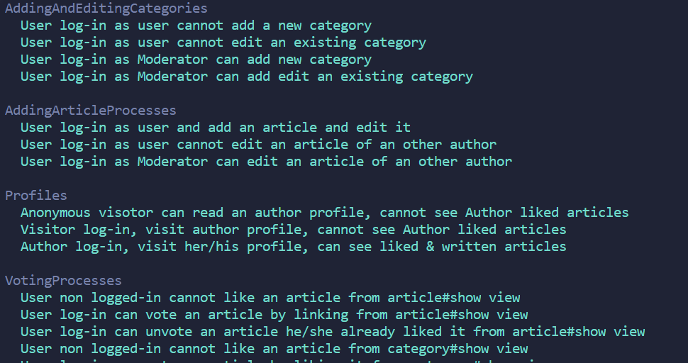
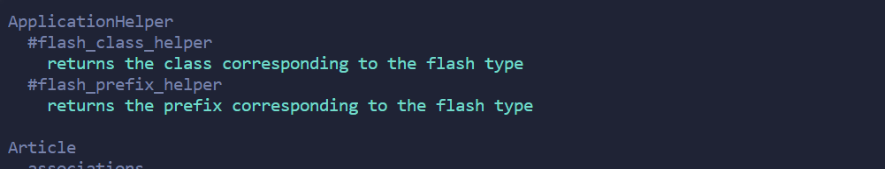

# Building Photosynthèse Magazine with Ruby on Rails

## About the project:

In this project, I built a community Blog magazine specialized in Plants, Ecological farming, and Home gardening.
This is the Capstone project for the end of Ruby On Rails Module in [Microverse](https://www.microverse.org/) currriculum.

This project was built following the specifications , and user cases given by Microverse.

[Read the projects specifications](https://www.notion.so/Lifestyle-articles-b82a5f10122b4cec924cd5d4a6cf7561)

## Built with:

  <a href="https://www.ruby-lang.org/en/documentation/"></a>
  <a href="https://guides.rubyonrails.org/"></a>
  <a href="https://github.com/"></a>
  <a href="#"></a>
  <a href="#"></a>
  <a href="#"></a>
  <a href="#"></a>
  <a href="#"></a>
  <a href="#"></a>
  <a href="#"></a>
  <a href="https://developer.mozilla.org/en-US/docs/Web/JavaScript"></a>
  <a href="#"></a>


## Table of content:

- [About the project](#about-the-project)
- [Built with](#built-with)
- [Presentation/Demo](#presentation)
- [Dependencies](#dependencies)
- [Linting tools:](#Linting-tools)
- [Data Models](#data-models)
- [Getting started](#getting-started)
- [Run tests](#run-tests)
- [Automated Tests](#automated-tests)
- [Deployment](#deployment)
- [Author](#author)
- [Contributing](#contributing)
- [Acknowledgments](#acknowledgments)
- [License](#License)

## Presentation/Demo:

- Link to the deployed version of the project:
[Photosynthèse-blog](https://whispering-dawn-59076.herokuapp.com/)

- Video-presentation of the project
[Demo-video](https://youtu.be/Zny3mNp3-IE)

- Main views screenshots:
<br>

<span> </span>
<br>
<span> </span>
<br>

## Dependencies:

Iportant Gems and dependencies used in this web application:

<table>
  <tr>
    <th>Dependency</th>
    <th>for</th>
    <th>Development</th>
    <th>Test</th>
    <th>Production</th>
  </tr>
  <tr>
    <td>Postgresql</td>
    <td>Database</td>
    <td>⭐️</td>
    <td></td>
    <td>⭐️</td>
  </tr>
  <tr>
    <td>Devise</td>
    <td>For user authentication</td>
    <td>⭐️</td>
    <td>⭐️</td>
    <td>⭐️</td>
  </tr>
  <tr>
    <td>Rspec</td>
    <td>Testing framework</td>
    <td></td>
    <td>⭐️</td>
    <td></td>
  </tr>
  <tr>
    <td>Capybara</td>
    <td>Features and Integration tests</td>
    <td></td>
    <td>⭐️</td>
    <td></td>
  </tr>
  <tr>
    <td>Shoulda Matchers</td>
    <td>Models and association tests</td>
    <td></td>
    <td>⭐️</td>
    <td></td>
  </tr>
    <tr>
    <td>Database cleaner</td>
    <td>Cleaning database in testing</td>
    <td></td>
    <td>⭐️</td>
    <td></td>
  </tr>
  </tr>
  <tr>
  <td>rails_admin</td>
    <td>Engine for administration</td>
    <td>⭐️</td>
    <td></td>
    <td>⭐️</td>
  </tr>
  </tr>
  <tr>
    <td>CanCanCan</td>
    <td>Managing user roles and abilities</td>
    <td>⭐️</td>
    <td></td>
    <td>⭐️</td>
  </tr>
  </tr>
  <tr>
    <td>Figaro</td>
    <td>Managing credentials</td>
    <td>⭐️</td>
    <td></td>
    <td>⭐️</td>
  </tr>
  <tr>
    <td>aws-sdk-s3</td>
    <td>Amazon s3 for active storage</td>
    <td>⭐️</td>
    <td></td>
    <td>⭐️</td>
  </tr>
  <tr>
  <td>will_paginate</td>
    <td>Views pagination</td>
    <td>⭐️</td>
    <td></td>
    <td>⭐️</td>
  </tr>
  <td>Bullet</td>
    <td>N+1 querries debugging</td>
    <td>⭐️</td>
    <td></td>
    <td></td>
  </tr>
</table>

## Linting tools:

<table>
  <tr>
    <th>Linter</th>
    <th>Use</th>
    <th>Files</th>
  </tr>
  <tr>
    <td>Rubocop</td>
    <td>Linting Ruby errors</td>
    <td>.rb</td>
  </tr>
    <tr>
    <td>Stylelint</td>
    <td>Linting styling errors</td>
    <td>.css .scss</td>
  </tr>
</table>

## Data Models

<br>



<br><br>

## Getting started (Development)

To get a local copy of the repository please run the following commands on your terminal:

```
$ git clone git@github.com:CalyCherkaoui/blogging_app_ror.git
$ cd blogging_app_ror
$ git checkout development
$ bundle install --without production
$ yarn install --check-files
$ rails db:create
$ rails db:migrate
$ rails db:seed
```

Start server with:
```
$ sudo service postgresql restart
$ rails server
```
In your browser's adress field, type : http://localhost:3000

## Run tests
```
$ rpsec --format documentation
```

## Automated Tests:

### Models

<br>

<br>

### Integrations

<br>

### Features

<br>

### Helpers


<br>

## Deployment:

This web-application was deployed with Heroku

## Author

👤 **Houda Cherkaoui**

- Github: [@CalyCherkaoui](https://github.com/CalyCherkaoui)
- Twitter: [@Houda59579688](https://twitter.com/Houda59579688)
- Linkedin: [Houda-Cherkaoui](https://www.linkedin.com/in/houda-cherkaoui-64106395/)


## 🤝 Contributing

Contributions, issues and feature requests are welcome!

## Show your support

Give a ⭐️ if you like this project!

## Acknowledgments

- Design based on the work of [Nelson Sakwa](https://www.behance.net/sakwadesignstudio) published in [Behance.net](https://www.behance.net/gallery/14554909/liFEsTlye-Mobile-version)
- Hat tip to [stackoverflow](https://stackoverflow.com) community.
- Hat tip to [Microverse](https://www.microverse.org/) TSE for Code Review
- Hat tip to anyone whose code was used

## 📝 License

All source codeis available jointly under the MIT License.
See [MIT licence]() for details.
